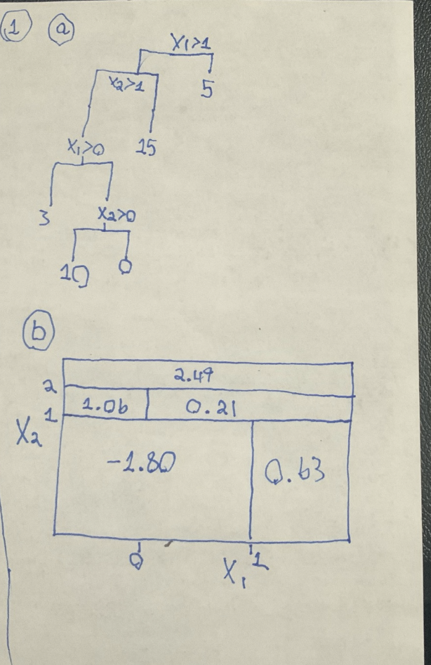

```{r setup, include=FALSE}
knitr::opts_chunk$set(echo = TRUE)
```

# 1
I drew it by hand
```{r}


```


# 2
if we do the majority vote. we would count those whose probability of red is greater than 0.5
6 estimates have a probability greater than 0.5 and 4 estimates have a probability less than 0.5 so the majority method would classify red.

the second method is the average probability method. we would take the average and if its greater or equal to 0.5 we would classify red.
```{r}
X <- c(0.1, 0.15, 0.2, 0.2, 0.55, 0.6, 0.6,
0.65, 0.7, 0.75)
mean(X)
```
0.45 is less than 0.5 so we would classify it as green

# 3
```{r}
library(tidyverse)
library(ISLR)
attach(OJ)
OJ <- OJ
glimpse(OJ)
```

## a
```{r}
set.seed(123)
train_index <- sample(1:nrow(OJ), 800)
train_data <- OJ[train_index, ]
test_data <- OJ[-train_index, ]
```

## b
```{r}
library(tree)

tree_model <- tree(Purchase ~ . ,data = OJ) # except for buy as predictors but dont know which one that is.

summary(tree_model)
```
There are 8 terminal nodes. the misclassification error rate is about 16%.

## c
```{r}
tree_model
```
if LoyalCH is less than 0.5036, and LoyalCH is greater than 0.276142, and PriceDiff is greater than 0.05, the we would estimate the response would be of the purchase would be CH.

## d
```{r}
plot(tree_model)
text(tree_model)
```
if LoyalCH is less than 0.5036, and LoyalCH is greater than 0.276142, and PriceDiff is greater than 0.05, the we would estimate the response would be of the purchase would be CH.

## e
```{r}
Yhat <- predict(tree_model, newdata = test_data, type = "class")
summary(Yhat)
```

```{r}
table(Yhat, test_data$Purchase)
```

```{r}
(30+15)/(151+30+15+74)
```
test error rate is about 16%

## f 
```{r}
cv <- cv.tree(tree_model)
cv
```
```{r}
cv$size[which.min(cv$dev)]
```
the optimal tree size is 8 terminal nodes

## g
```{r}
cv <- cv.tree(tree_model, FUN = prune.misclass)
cv
plot(cv$size, cv$dev, type = "b")
```


## h
```{r}
min_index <- which.min(cv$dev)
best_size <- cv$size[min_index]
min_error <- cv$dev[min_index] / nrow(OJ)

best_size
min_error
```


## i
```{r}
tr_opt <- prune.tree(tree_model, best =8)
summary(tr_opt)
```

## j
the training error rate for the pruned tree is lower than the error rate for the unprune tree.

## k
the test error rates for the pruned tree is lower than the test error rate for the unpruned tree.